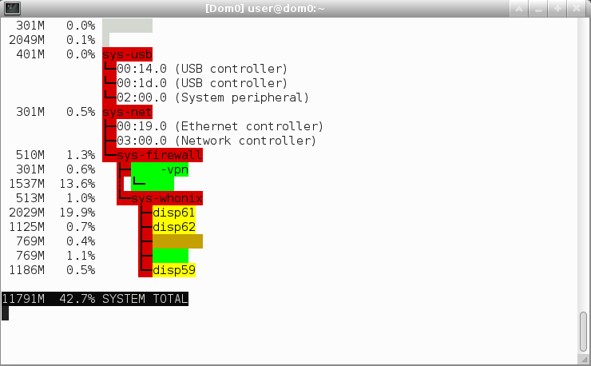

qubes-print-vm-status
====
This is a hacky but versatile tool designed to generate a visualization of the Qubes VM state, assigned PCI devices, and network topology.

This tool can be run either in one-shot mode or as a monitor; it supports colors for terminals and `conky`.

Screenshot
====

